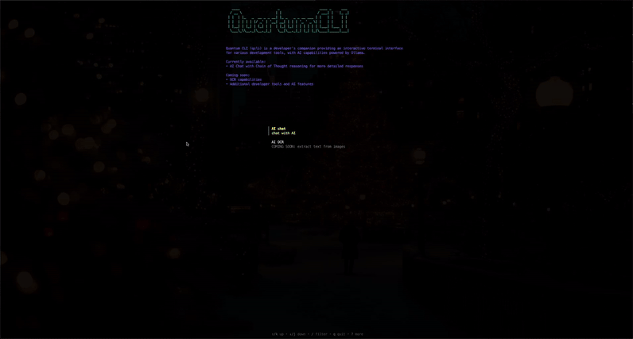

<div align="center">

```
   ____                   _                    ____ _     ___ 
  / __ \                 | |                  / ___| |   |_ _|
 | |  | |_   _  __ _ _ __| |_ _   _ _ __ ___ | |   | |    | | 
 | |  | | | | |/ _' | '__| __| | | | '_ ' _ \| |   | |    | | 
 | |__| | |_| | (_| | |  | |_| |_| | | | | | | |___| |___ | | 
    \___\_\\__,_|\__,_|_|   \__|\__,_|_| |_| |_|\____|_____|___|  
```

[](https://github.com/andreivisan/quantum_cli/actions/workflows/tests.yml)

</div>

## Project Vision & Goals

Quantum CLI is a versatile command-line interface tool that aims to be a developer's swiss army knife, combining both AI and traditional development tools (in the future). At its core, it simplifies the use of Chain of Thought AI models through Ollama and LangChain, making them available offline and directly in your terminal. Our vision is to create a comprehensive toolkit that enhances developer productivity by providing easy access to AI capabilities alongside essential development features. The tool prioritizes offline availability, speed, and ease of use, making it a reliable companion for both AI-assisted tasks and traditional development workflows.



## Key Features

The tool is using QwQ AI model, which is a Chain of Thought AI model. But in order to make it less verbose, we are using a custom prompt to make it more concise.

- **AI-Powered Development**: Utilize Chain of Thought AI models through Ollama and LangChain to get instant AI-assisted insights and solutions.
- **Offline Access**: Enjoy the benefits of offline AI capabilities without relying on cloud services.
- **Speed and Efficiency**: Experience fast and efficient AI-powered responses directly in your terminal.
- **Beautiful and Easy to Use**: Beautiful response formatting using Markdown rendering for AI responses.
- **Ollama Installation Management**: The CLI tool will guide you through the installation if you don't have it.

## Prerequisites

- Go 1.21 or later
- [Ollama](The CLI tool will guide you through the installation if you don't have it)
- Python 3.10 or later

### Get the Python server

Because LangChain only has an official library for Python and JS, we need to run a Python server to implement Chain of Thought and communicate with the AI.

Please follow the instructions [here](https://github.com/andreivisan/quantum_server) to get the server running.

## Installation

### Option 1: Go Install

If you have Go installed, you can install CharmLlama using:

```bash
go install github.com/andreivisan/quantum_cli@latest
```

```bash
export PATH=$PATH:$(go env GOPATH)/bin
```

Then reload your shell configuration:

```bash
source ~/.zshrc
```

### Option 2: Build from source

- Clone the repository

```bash
git clone https://github.com/andreivisan/quantum_cli.git
cd quantum_cli
```

- Build the binary

```bash
go build -o quantum_cli
```

- Add the binary to your PATH

## Usage

If the binary is in your PATH, you can run it directly:

```bash
quantum_cli
```

If you want to run it from the current directory, you can use:

```bash
./quantum_cli
```

## Philosophy on Quality & Design

We believe that developer tools should not only be functional but also joy to use. Our commitment to quality is reflected in:

- **Clean Architecture**: Following SOLID principles and clean architecture patterns to ensure maintainable, testable code.
- **Rigorous Testing**: Comprehensive test coverage to catch issues early and maintain reliability.
- **User Experience**: Thoughtful CLI interface design with clear feedback, helpful error messages, and intuitive commands.
- **Performance**: Optimized for speed and efficiency, respecting system resources while delivering quick results.

## Contributing

Contributions are welcome! Please check the [CONTRIBUTING](CONTRIBUTING.md) file for details.

## License

This project is licensed under the MIT License - see the [LICENSE](LICENSE) file for details.
